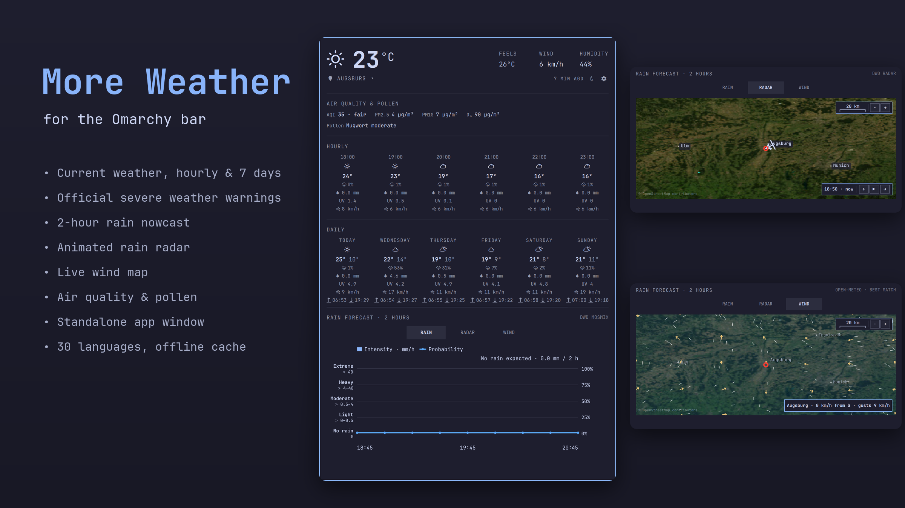
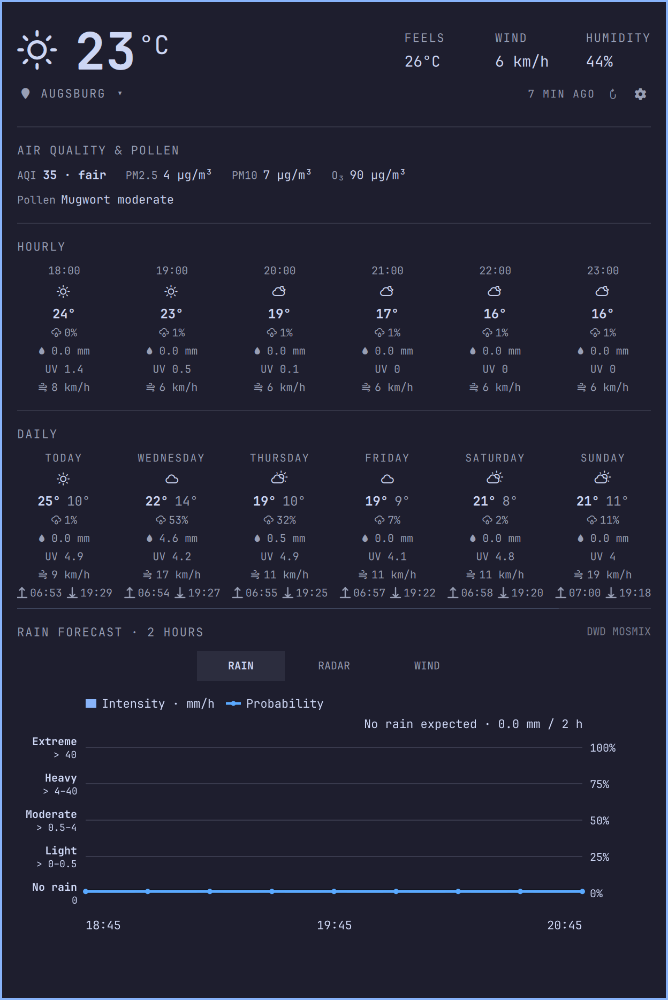
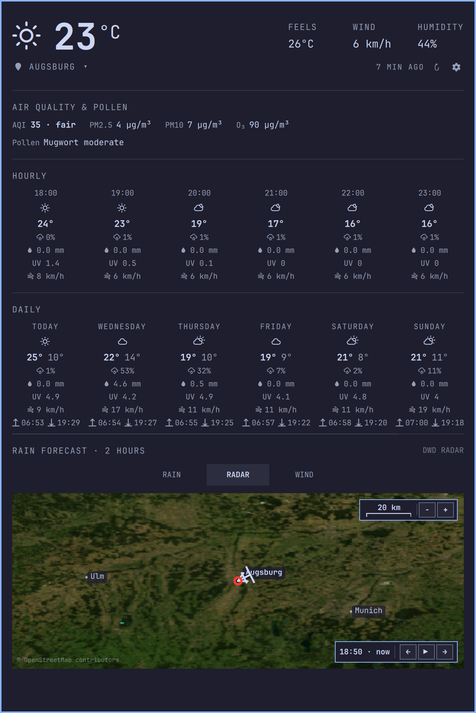
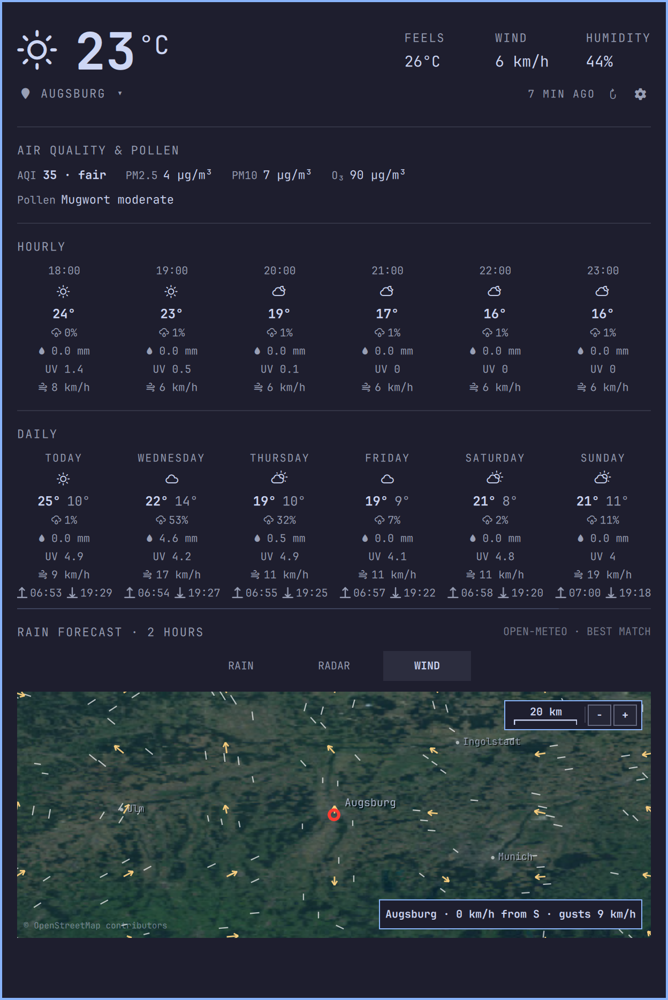
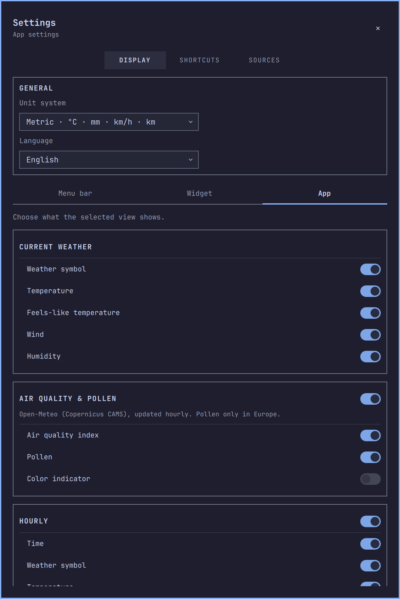
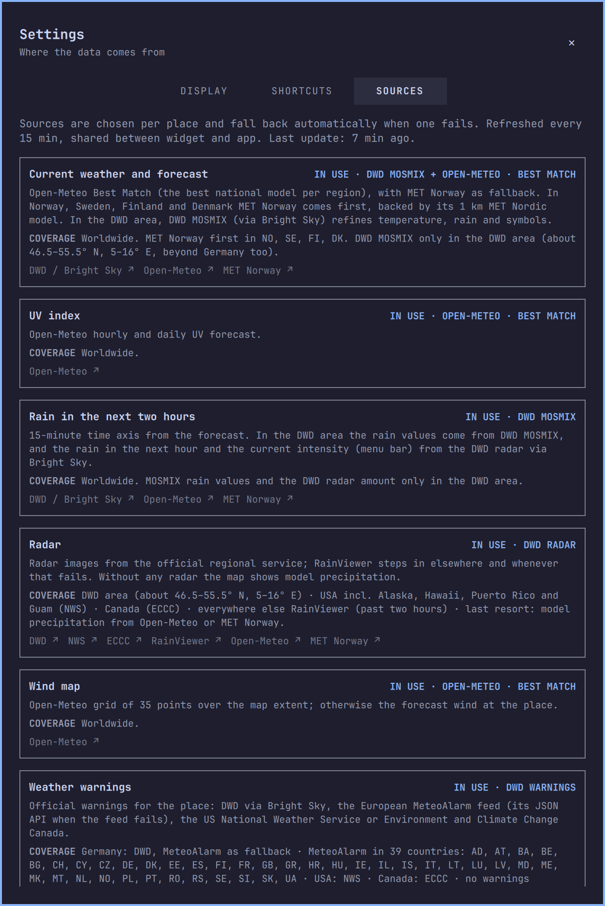

# More Weather

A detailed weather plugin for the [Omarchy](https://omarchy.org) bar, with official
severe weather warnings, a two-hour rain nowcast, an animated rain radar, a live
wind map, air quality and pollen. The same view also runs as a standalone app
window.



## Features

**In the bar**
- Weather symbol, temperature, feels-like, wind, humidity and precipitation.
  Choose which of these the bar shows.
- Optional hints: rain starting soon, poor air quality, high pollen and a colored
  warning mark while an official warning is active.
- Left click opens the popup, middle click refreshes, right click sends a short
  status notification.

**In the popup and the app**
- **Current conditions:** Temperature, feels-like, wind and humidity, with the
  moon phase behind the weather symbol at night.
- **Official warnings:** Severity, time window, description and instructions.
- **Air quality and pollen:** European or US AQI, PM2.5, PM10, ozone and the pollen
  types that currently count.
- **Hourly forecast:** Weather symbol, temperature, rain probability and amount, UV
  index and wind. Where the DWD radar reaches, the symbol shows the rain it measures, and a
  thunderstorm only when a warning or a station confirms one.
- **7-day forecast:** Min/max temperature, rain, UV, wind, sunrise and sunset.
- **Rain nowcast:** Intensity in 15-minute steps and probability over the next two hours.
  In the DWD area both come from the DWD radar nowcast, renewed every five minutes: rain
  already falling, moved along its track, blended with DWD MOSMIX for the probability. The
  bars take the DWD radar colours, and the hourly forecast uses the same values.
- **Rain radar:**
  - Animated frames with play/pause, stepping and zoom.
  - City labels, plus a drift arrow at the map's true scale, marked in 15-minute steps up to
    two hours. It follows the frame on screen and is tracked from the radar itself in the
    DWD area; elsewhere it uses the model wind at about 3 km (700 hPa).
- **Wind map:** An animated particle field from a 35-point model grid over the
  visible map area.
- **Locations:** Search for places, keep a list of favorites or detect your location
  automatically.
- **Notifications:** Desktop notifications for severe and extreme warnings and for
  rain starting within 30 minutes.

**Everywhere**
- **30 interface languages,** including right-to-left scripts, plus metric or
  US/imperial units, both chosen automatically or by hand.
- **Separate display settings** for the bar, the popup and the app, and the widget's
  position in the bar (left, center or right).
- **Offline cache:** When a service or the network is down, the last data (up to
  three days old) stays visible, marked in italics.
- **Full keyboard control;** every shortcut is listed under Settings → Shortcuts.
- **Settings → Sources** shows which service is serving each kind of data right now.

| Overview | Radar | Wind |
|---|---|---|
|  |  |  |

| Display settings | Data sources |
|---|---|
|  |  |

## Data sources

The best available source is chosen for the place, and another one takes over when a
service fails. Details are in [PROVIDERS.md](PROVIDERS.md) and in Settings → Sources.

| Data | Sources |
|---|---|
| Forecast | Open-Meteo (best national model), MET Norway; DWD MOSMIX via Bright Sky in the DWD area |
| Radar | DWD (Germany and neighbours), NOAA/NWS MRMS (United States), ECCC GeoMet (Canada), RainViewer elsewhere; model precipitation as last resort |
| Warnings | DWD, NWS, ECCC, MeteoAlarm (39 European countries) |
| Wind map, UV, air quality, pollen | Open-Meteo (air quality from Copernicus CAMS) |
| Map background | NASA Blue Marble imagery served by the DWD GeoServer |
| Places | Open-Meteo geocoding, Nominatim, OpenStreetMap Overpass (overpass-api.de, overpass.private.coffee, maps.mail.ru); IP geolocation (ipwho.is, ipapi.co, GeoJS) only when the location is set to automatic |

All services are free public APIs and need no account or API key. The plugin sends
requests only to the services listed here and stores nothing outside your own
computer. As with any web request, these services see your IP address and the
coordinates of the places you look up.

## Requirements

- Omarchy with the Quattro shell (Omarchy 4). The plugin uses the shell's Quickshell
  modules and the `omarchy-weather-location` and `omarchy-weather-status` commands
  that come with Omarchy.
- `notify-send` for desktop notifications (installed with Omarchy).
- An internet connection.

## Installation

```bash
omarchy plugin add https://github.com/T-The-Coder/more-weather.git --enable
```

Or install it first and enable it later:

```bash
omarchy plugin add https://github.com/T-The-Coder/more-weather.git
omarchy plugin enable more-weather
```

The location is shared with Omarchy's built-in weather widget. If you only want
More Weather in the bar, remove the built-in weather widget from the bar layout.

### Standalone app (optional)

The app shows the same view in a normal window. To open it, click the weather symbol
or temperature in the popup, or run:

```bash
~/.config/omarchy/plugins/more-weather/app/more-weather
```

To add the app to the app launcher, turn on **Settings → Display → General → Show in
app launcher**. This creates a desktop entry and an icon in your theme's colors; turning
the switch off removes them again. Nothing is added to the launcher unless you turn the
switch on. The same works from a terminal:

```bash
~/.config/omarchy/plugins/more-weather/app/more-weather --install-desktop-entry
~/.config/omarchy/plugins/more-weather/app/more-weather --remove-desktop-entry
```

The app and the bar widget share their data, so running both does not double the
requests.

## Updating

```bash
omarchy plugin update more-weather
```

See [CHANGELOG.md](CHANGELOG.md) for release notes.

## Removal

1. If you added the app to the launcher, turn off **Show in app launcher** first. If
   you forget, the leftover entry deletes itself the next time you open it.

2. Remove the plugin:

   ```bash
   omarchy plugin remove more-weather
   ```

3. Optional: delete the settings and cached data:

   ```bash
   rm -f ~/.local/state/omarchy/settings/more-weather-*.json
   rm -rf ~/.cache/more-weather
   ```

`~/.local/state/omarchy/settings/weather.json` holds the location shared with
Omarchy's built-in weather widget and is left in place.

## Files

| Path | Content |
|---|---|
| `~/.local/state/omarchy/settings/weather.json` | Location (shared with Omarchy, written via `omarchy-weather-location`) |
| `~/.config/omarchy/shell.json` | Omarchy's bar layout; changed only through `omarchy-bar move` when you pick a position under Settings → General |
| `~/.local/state/omarchy/settings/more-weather-*.json` | Display settings, favorites, cache, data shared between bar and app |
| `~/.cache/more-weather/map-images/` | Downloaded radar and map pictures, removed after three hours |
| `$XDG_RUNTIME_DIR/more-weather-app/` | Temporary app configuration (links to the plugin and the Omarchy shell) |
| `~/.local/share/applications/more-weather.desktop`, `~/.local/share/more-weather/launch`, `~/.local/share/icons/hicolor/scalable/apps/more-weather.svg` | App launcher entry, only while **Show in app launcher** is on |

## License

MIT, see [LICENSE](LICENSE). More Weather started as a copy of Omarchy's built-in
weather widget (MIT).

Map data © OpenStreetMap contributors. Radar and map imagery © DWD, NOAA/NWS, ECCC,
RainViewer and NASA Blue Marble. Weather data by Open-Meteo, MET Norway, Bright Sky/DWD and MeteoAlarm.
