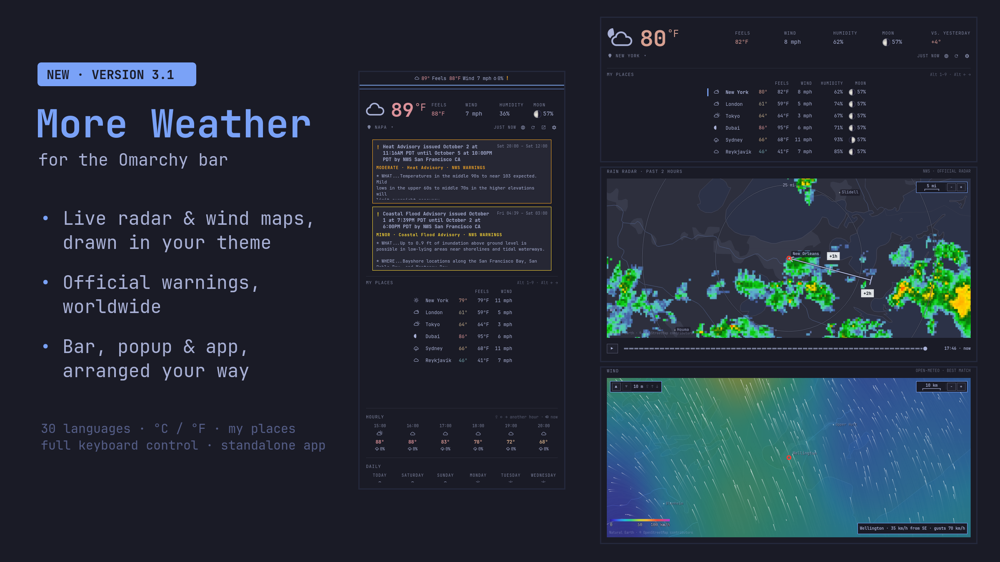
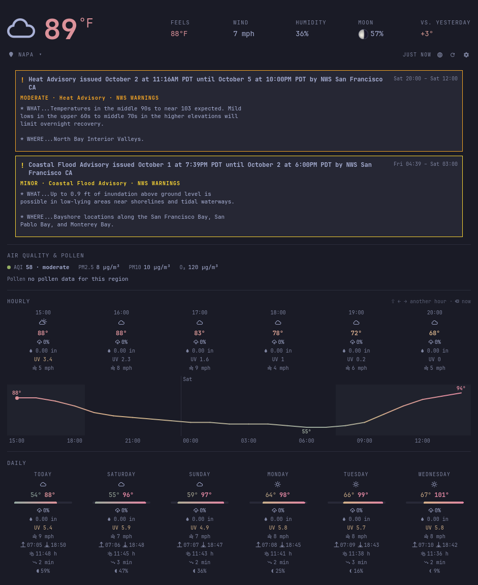
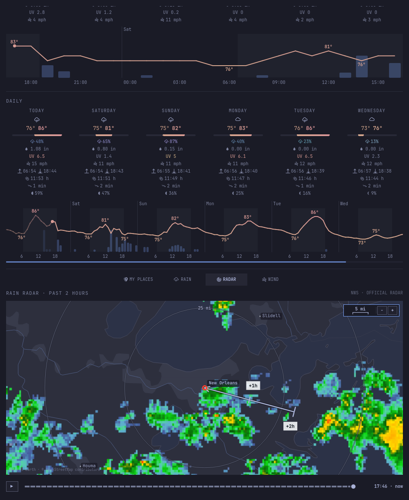
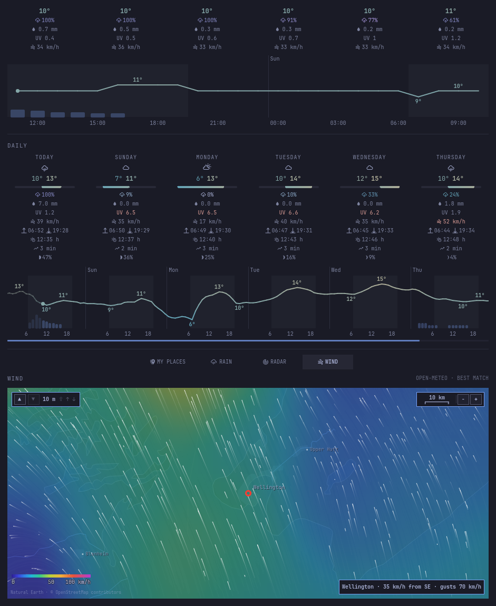
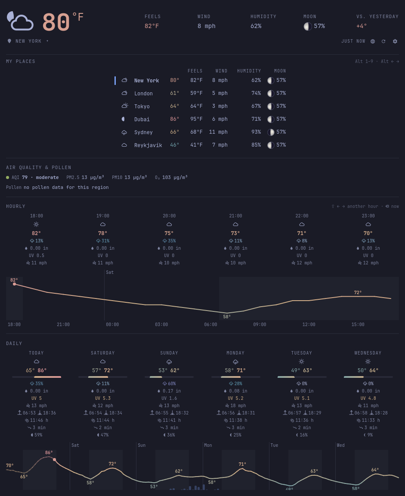
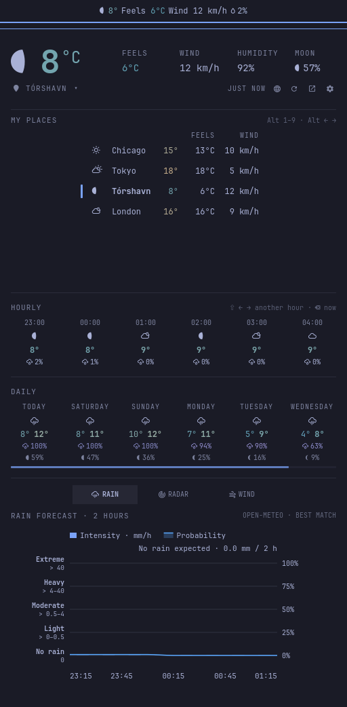
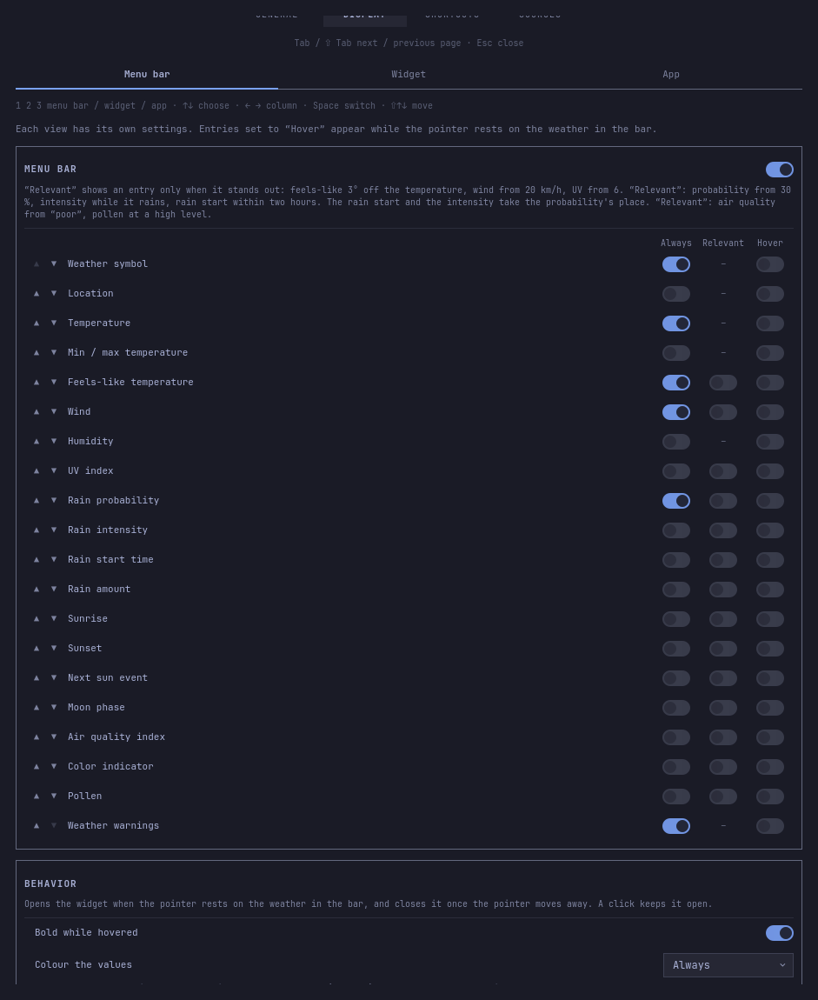

# More Weather

A detailed weather plugin for the [Omarchy](https://omarchy.org) bar, with official
severe weather warnings from national weather services, a two-hour rain nowcast, a rain
radar and a wind map drawn in your theme that you can move and zoom, temperature lines,
rain alerts, air quality and pollen, and all your places at a glance. The same view also
runs as a standalone app window.



## Features

**In the bar**
- Weather symbol, temperature, feels-like, wind, humidity and precipitation.
  Choose which of these the bar shows. The rain drop shows the rain
  probability: outline below 25 %, half full from 25 %, full from 75 %.
- Optional hints: rain starting soon, poor air quality, high pollen and a colored
  warning mark while an official warning is active.
- While the pointer rests on the weather, its text and symbols turn bold (switch
  **Bold while hovered** in the menu bar settings). Entries set to **Hover**
  appear only then, entries set to **Relevant** only when they stand out, and the
  popup can open on hover too.
- **Colour the values** (menu bar settings, below **Bold while hovered**): off, while
  hovered (default) or always. Temperature, the day's low and high, feels-like, wind,
  UV and the rain chance then take the popup's colour accents; the symbol, sun times,
  moon and pollen stay plain, the warning mark keeps its colour, and the global
  **Colour accents** switch turns this off too.
- Left click opens the popup, middle click refreshes, right click sends a short
  status notification.

**In the popup and the app**
- **Current conditions:** Temperature, feels-like, wind, humidity, the moon phase (a
  shaded sphere) with its lit share, the change against yesterday at the same hour and the next full or
  new moon, plus the moon behind the weather symbol at night. A button (or `w`) opens
  the place at a weather service: NWS in the USA, ECCC in Canada, yr.no elsewhere. In
  the popup, the button beside the gear (or `o`, or a click on the symbol or the
  temperature) opens the same view in the app.
- **Official warnings:** Severity, time window, description and instructions, from the
  national weather service in Germany, the 39 MeteoAlarm countries, the USA, Canada,
  Australia, New Zealand, Japan, Brazil and Argentina, and elsewhere from the official
  CAP feeds registered with the WMO (about 115 countries).
- **Air quality and pollen:** European or US AQI, PM2.5, PM10, ozone and the pollen
  types that currently count.
- **Hour cursor:** Shift+←/→ or a click on an hour shows that hour in the current weather.
- **Hourly forecast:** Weather symbol, temperature, rain probability and amount, UV index
  and wind, and a temperature line over the next 24 hours (after linecast) with rain bars,
  daylight bands, midnight rules, labelled highs and lows, and a click to pick the hour. Where the DWD radar reaches, the symbol shows the rain it measures, and a
  thunderstorm only when a warning or a station confirms one.
- **7-day forecast:** Min/max temperature, as a bar and as an hour-by-hour line through
  the week with each day under its column, rain bars, daylight bands and the day's high
  and low (each switchable), rain, UV, wind, sunrise, sunset, moon phase,
  day length and its change against the day before.
- **Rain nowcast:** Intensity in 15-minute steps and probability over the next two hours.
  In the DWD area both come from the DWD radar nowcast, renewed every five minutes: rain
  already falling, moved along its track, blended with DWD MOSMIX for the probability. The
  bars take the DWD radar colours, the probability is a thin line over a translucent
  area, and the hourly forecast uses the same values. In Norway, Sweden, Finland and Denmark the amounts come
  from MET Norway's radar nowcast, in Austria from GeoSphere Austria's INCA nowcast, in
  the Netherlands and Belgium from Buienradar, in Japan from JMA's one-hour radar
  nowcast.
- **Rain radar:**
  - Official radar in the DWD area, the USA, Canada, Finland, the Netherlands and
    Japan; RainViewer elsewhere.
  - Animated frames with a timeline under the map (after Weather Radar): play/pause, a
    notched track to drag or click through the frames with a mark for now and the
    forecast part tinted, and the frame's time. Plus zoom and distance rings around the
    place.
  - A map drawn in the theme's colours (land, lakes, towns, rivers, borders from Natural
    Earth, shipped with the plugin, so it needs no network), or the satellite picture as
    a map style. Drag it or use Ctrl + arrow keys to move it, Ctrl + wheel zooms towards
    the pointer (a plain wheel scrolls the page), `0` or the crosshair button returns to
    the place. Town names come from OpenStreetMap in your language, with Natural Earth's
    larger towns filling in offline or where OpenStreetMap has none. The wind map shares the same view.
  - City labels, plus a drift arrow at the map's true scale, marked in round steps from
    5 minutes up to two hours (three or four when zoomed far out), so it keeps its time
    labels at every zoom. It follows the frame on screen and is tracked from the radar itself in the
    DWD area; elsewhere it uses the model wind at about 3 km (700 hPa).
- **Wind map:** After RegenVorschau: the wind speed as a colour wash (deep blue for calm
  through cyan, green and yellow to red and violet for storms, with a legend) and white
  streaks drifting with the wind, faster where it blows harder, from a 35-point model
  grid over the visible area, at 10 m, 120 m or the 850, 700, 500 and 250 hPa levels
  (about 1.5 to 10 km). The wind under the pointer shows its speed and direction. The
  animation takes about a fifth of a processor core while it is on screen.
- **Locations:** Search for places (Open-Meteo's geocoder while typing, Nominatim on
  Enter when it finds nothing), keep a list of favorites or detect your location automatically. Settings →
  General → Places imports the cities of [More Time](https://github.com/T-The-Coder/more-time)'s
  world clock as favorites.
- **My places:** All favorites at a glance, one line each with symbol, temperature,
  feels-like, wind, humidity and moon. A click, Alt+1–9 or Alt+←/→ switches to a
  place; for global keys see [IPC](#ipc).
- **Notifications:** Desktop notifications for severe and extreme warnings and for
  rain on its way. For rain you choose the strength (any, moderate or more, heavy only)
  and a radius of 10 to 100 km: rain moves at about 50 km/h, so the radius sets how far
  ahead the nowcast is read (25 km ≈ 30 minutes, 100 km ≈ 2 hours). Rain that gets
  stronger is announced again.

**Everywhere**
- **30 interface languages,** including right-to-left scripts, plus metric or
  US/imperial units, both chosen automatically or by hand. Wind can have its own unit
  (km/h, m/s, mph, knots or Beaufort), and the forecast and the radar with its
  rain nowcast each have their own update interval in the settings.
- **Colour accents** in the theme's palette: temperatures by warmth, rain chance from the
  text colour through cyan, dark blue and magenta to violet, UV and strong wind by level,
  a weekly temperature bar and the air quality dot, and in the bar on request; one
  switch turns them off.
- **Separate display settings** for the bar, the popup and the app, and the widget's
  position in the bar (left, center or right).
- **Export and import** of all settings and your places as one JSON file (Settings →
  General); an import first saves the current settings, so it can be undone.
- **Sections your way:** Current weather, my places, air quality, hourly, daily, rain,
  radar and wind can be put in any order. All but the current weather can also be
  shown as a tab; the tabs share one strip that has its own place in the order, and
  keys 1–9 pick them in their order. Each tab carries its section's symbol next to
  its name; when the strip gets too narrow for the names (all seven sections as
  tabs), it shows the symbols alone and the name as a tooltip. The current weather, with place, refresh, settings and the warnings
  below it, always stays in the window.
- **Offline cache:** When a service or the network is down, the last data (up to
  three days old) stays visible, marked in italics.
- **Full keyboard control,** settings included; every shortcut is listed under
  Settings → Shortcuts, and the settings name their keys where they apply.
- **Settings → Sources** shows which service is serving each kind of data right now.

## Screenshots

| Napa in a heat wave, with the NWS Heat Advisory | Storms over New Orleans on the NWS radar | Wellington in a gale, gusts of 70 km/h |
|---|---|---|
|  |  |  |

| My places: six cities at a glance | The menu bar in colour, over the widget | Each bar entry: Always, Relevant or Hover |
|---|---|---|
|  |  |  |

## Keyboard

The same keys work in the popup and in the app; Settings → Shortcuts lists them
too, and the settings name their keys where they apply.

| Keys | Action |
|---|---|
| **General** | |
| `Esc` | Close the search, the settings or the list, then the panel |
| `Tab` / `⇧ Tab` | Next / previous bar panel (popup) |
| `Ctrl ,` | Open the settings |
| `r` / `F5` | Refresh now |
| `o` | Open the app (popup) |
| `w` | Open the place at its weather service |
| `Alt 1`–`9` | Show favourite 1 to 9 |
| `Alt ← →` | Previous / next favourite |
| `/` / `Enter` | Search a place |
| **Scrolling** | |
| `↑ ↓` / `j k` | Scroll |
| `PgUp` / `PgDn` | Scroll a page |
| `Home` / `End` | To the top / bottom |
| `← →` / `h l` | Scroll the daily forecast |
| `⇧ ← →` | Show another hour in the current weather |
| `⌫` / `Esc` | Back to now |
| **Tabs and maps** | |
| `1`–`9` | The tabs, in their order |
| `← →` / `h l` | Radar: previous / next frame |
| `Space` | Radar: play / pause |
| `+` / `−` | Map: zoom in / out |
| `0` | Map: back to the place |
| `Ctrl` + arrows, drag | Map: move |
| `Ctrl` + wheel | Map: zoom towards the pointer |
| `⇧` + wheel | Daily forecast and radar timeline: sideways |
| `⇧ ↑ ↓` | Wind map: higher / lower |
| **Place search** | |
| `↑ ↓` | Move within the results or the saved places |
| `Tab` / `⇧ Tab` | Switch between results and saved places |
| `Enter` | Use the result, or switch to the saved place |
| `+` | In the saved places (`Tab`): add the marked result |
| `−` | In the saved places (`Tab`): remove the marked place |
| `Esc` | Close the search |
| **Settings** | |
| `Tab` / `⇧ Tab` | Next / previous settings page |
| `1` `2` `3` | Menu bar / widget / app settings (Display) |
| `↑ ↓` / `j k` | Previous / next setting |
| `← →` / `h l` | Change the value or pick the switch column |
| `Space` / `Enter` | Switch, open the list or press the button |
| `⇧ ↑ ↓` / `J K` | Move the entry up / down |
| `PgUp` / `PgDn` | Scroll a page |
| `Esc` | Close the settings |
| **Mouse** | |
| Left click on the weather in the bar | Open / close the popup |
| Left click on the weather in the popup | Open the app |
| Middle click on the weather in the bar | Refresh now |
| Right click on the weather in the bar | The weather as a notification |

## Data sources

The best available source is chosen for the place, and another one takes over when a
service fails. Details are in [PROVIDERS.md](PROVIDERS.md) and in Settings → Sources.

| Data | Sources |
|---|---|
| Forecast | Open-Meteo (best national model), MET Norway; DWD MOSMIX via Bright Sky in the DWD area |
| Radar | DWD (Germany and neighbours), NOAA/NWS MRMS (United States), ECCC GeoMet (Canada), RainViewer elsewhere; model precipitation as last resort |
| Warnings | DWD, NWS, ECCC, MeteoAlarm (39 European countries) |
| Wind map, UV, air quality, pollen | Open-Meteo (air quality from Copernicus CAMS) |
| Map background | NASA Blue Marble imagery served by the DWD GeoServer |
| Places | Open-Meteo geocoding, Nominatim, OpenStreetMap Overpass (overpass-api.de, overpass.private.coffee, maps.mail.ru); IP geolocation (ipwho.is, ipapi.co, GeoJS) only when the location is set to automatic |

All services are free public APIs and need no account or API key. The plugin sends
requests only to the services listed here and stores nothing outside your own
computer. As with any web request, these services see your IP address and the
coordinates of the places you look up.

## Requirements

- Omarchy with the Quattro shell (Omarchy 4). The plugin uses the shell's Quickshell
  modules and the `omarchy-weather-location` and `omarchy-weather-status` commands
  that come with Omarchy.
- `notify-send` for desktop notifications (installed with Omarchy).
- An internet connection.

## Installation

```bash
omarchy plugin add https://github.com/T-The-Coder/more-weather.git --enable
```

Or install it first and enable it later:

```bash
omarchy plugin add https://github.com/T-The-Coder/more-weather.git
omarchy plugin enable more-weather
```

The location is shared with Omarchy's built-in weather widget. If you only want
More Weather in the bar, remove the built-in weather widget from the bar layout.

## Standalone app

The app shows the same view in a normal window. To open it, click the weather symbol
or temperature in the popup, the app button beside the gear, press `o`, or run:

```bash
~/.config/omarchy/plugins/more-weather/app/more-weather
```

To add the app to the app launcher, turn on **Settings → General → Show in app
launcher**. This creates a desktop entry and an icon in your theme's colors; turning
the switch off removes them again. Nothing is added to the launcher unless you turn the
switch on. The same works from a terminal:

```bash
~/.config/omarchy/plugins/more-weather/app/more-weather --install-desktop-entry
~/.config/omarchy/plugins/more-weather/app/more-weather --remove-desktop-entry
```

The app and the bar widget share their data, so running both does not double the
requests.

## Updating

```bash
omarchy plugin update more-weather
```

See [CHANGELOG.md](CHANGELOG.md) for release notes.

## Removal

1. If you added the app to the launcher, turn off **Show in app launcher** first. If
   you forget, the leftover entry deletes itself the next time you open it.

2. Remove the plugin:

   ```bash
   omarchy plugin remove more-weather
   ```

3. Optional: delete the settings and cached data:

   ```bash
   rm -f ~/.local/state/omarchy/settings/more-weather-*.json
   rm -rf ~/.cache/more-weather
   ```

`~/.local/state/omarchy/settings/weather.json` holds the location shared with
Omarchy's built-in weather widget and is left in place.

## Files

| Path | Content |
|---|---|
| `~/.local/state/omarchy/settings/weather.json` | Location (shared with Omarchy, written via `omarchy-weather-location`) |
| `~/.config/omarchy/shell.json` | Omarchy's bar layout; changed only through `omarchy-bar move` when you pick a position under Settings → General |
| `~/.local/state/omarchy/settings/more-weather-*.json` | Display settings, favorites, cache, data shared between bar and app; `more-weather-settings-backup.json` holds the settings from before the last import |
| `~/.local/state/omarchy/settings/more-time-cities.json` | More Time's cities; only read, when you import them under Settings → General → Places |
| `~/Downloads/more-weather-settings.json` | Exported settings (the default path; any other can be typed in) |
| `~/.cache/more-weather/map-images/` | Downloaded radar and map pictures, removed after three hours |
| `$XDG_RUNTIME_DIR/more-weather-app/` | Temporary app configuration (links to the plugin and the Omarchy shell) |
| `~/.local/share/applications/more-weather.desktop`, `~/.local/share/more-weather/launch`, `~/.local/share/icons/hicolor/scalable/apps/more-weather.svg` | App launcher entry, only while **Show in app launcher** is on |

## IPC

The popup answers to Quickshell IPC under the target `more-weather`, for global key
bindings and scripts:

```bash
qs ipc -p /usr/share/omarchy/shell call more-weather toggle
qs ipc -p /usr/share/omarchy/shell call more-weather tab radar
qs ipc -p /usr/share/omarchy/shell call more-weather favorite 2
qs ipc -p /usr/share/omarchy/shell call more-weather nextFavorite
qs ipc -p /usr/share/omarchy/shell call more-weather refresh
```

| Call | Effect |
|---|---|
| `open`, `close`, `toggle` (`show`, `hide`) | The popup |
| `edit` | Opens the popup with the place search |
| `settings` | Opens the popup with the settings |
| `refresh` | Fetches the forecast now |
| `favorite <n>` | Opens the popup on favourite *n* (from 1) |
| `nextFavorite`, `previousFavorite` | Opens the popup on the next / previous favourite |
| `tab <name>` | Picks a tab and scrolls it into view: `favorites`, `airQuality`, `hourly`, `daily`, `rain`, `radar`, `wind` (only sections shown as a tab); the popup is not opened |
| `providerStatus` | A JSON diagnosis: sources in use, cache, keyboard state |

## Development

The calculations (forecast merging, rain alerts, the temperature line, the
drift arrow), the map data and the translations have tests for Node's built-in
test runner, with nothing to install:

```bash
node --test tests/*.test.mjs
tests/qml-syntax.sh    # every QML file parses (qmllint)
tests/ui-shots.sh /tmp/shots    # screenshots of every view, offscreen
```

The interface texts live in one file per language, `i18n/<language>.js`
(English and German as full catalogues, the others as a compact list plus
keyed entries); `I18n.js` imports them all and keeps the lookup functions.
Every file stays well under the plugin marketplace's 512 KiB limit for a text
file. `tests/load.mjs` follows the `.import` lines when the tests load a file.

`tests/ui-showcase.sh` takes the pictures above from live data (six famous
cities as places, the current theme, the scenes given in `MW_SCENES`), and
`tools/build-preview.sh <its output directory>` puts `screenshots/` and
`preview.png` together from them; its header lists the scenes it expects.
The version appears in `manifest.json` and in the user agent of
`WeatherRequest.qml` and `WeatherImageStore.qml` (`more-weather/<major.minor>`).

`tests/ui-shots.sh` runs the app view offscreen with a throwaway home and
runtime directory, synthetic weather for Tórshavn (`tests/ui/fixtures/state.py`)
and no network (`MORE_PLUGINS_OFFLINE=1`), and saves a picture of every tab,
the search, every settings page and the popup's view; radar pictures are not
downloaded, so the radar tab shows its model fallback.

Some files are shared word for word with the sibling plugin
[More Time](https://github.com/T-The-Coder/more-time) apart from their names
(the switch rows, buttons, the bar placement, the app launcher entry, the
request component, the place search with its parsers and their tests, the bar
hover, the moon sphere with its drawing and tests, the test helpers and the CI
workflow).
`tools/sync-shared.sh from-sibling` or `to-sibling` copies them when both
repositories sit side by side, and `tests/shared-files.test.mjs` fails when
they drift apart (it is skipped without the sibling, and per file while the
sibling lacks a newly shared one).

They also run on GitHub for every push. The drawn map's data is built from
Natural Earth with `python3 tools/build-basemap.py` (only needed when the
source data or the layers change; the result, `data/basemap.bin`, is committed).

## License

MIT, see [LICENSE](LICENSE). More Weather started as a copy of Omarchy's built-in
weather widget (MIT).

Map data © OpenStreetMap contributors. Radar and map imagery © DWD, NOAA/NWS, ECCC,
RainViewer and NASA Blue Marble. Weather data by Open-Meteo, MET Norway, Bright Sky/DWD and MeteoAlarm.
